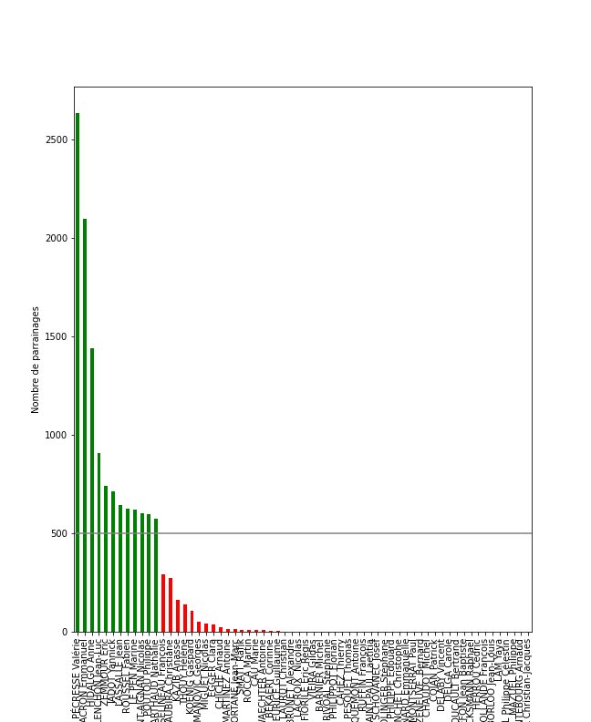
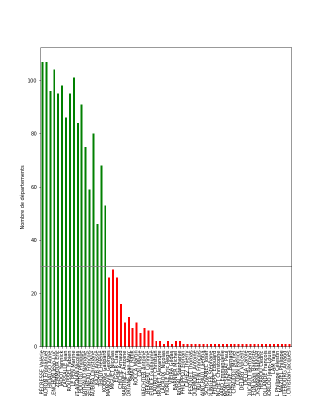
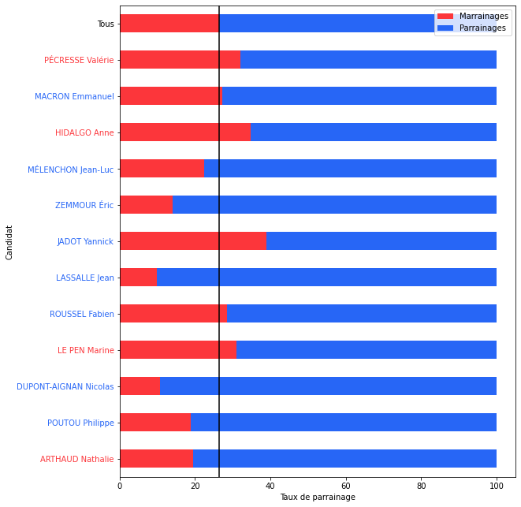
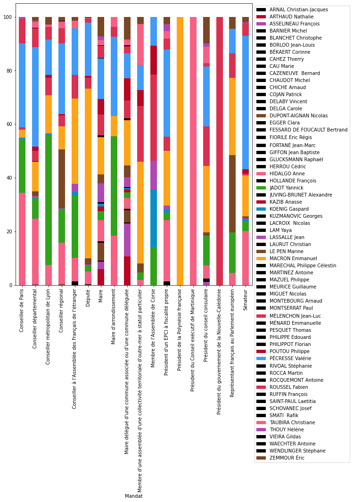
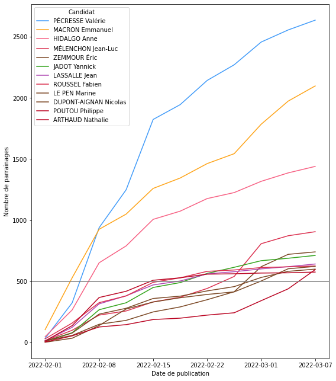
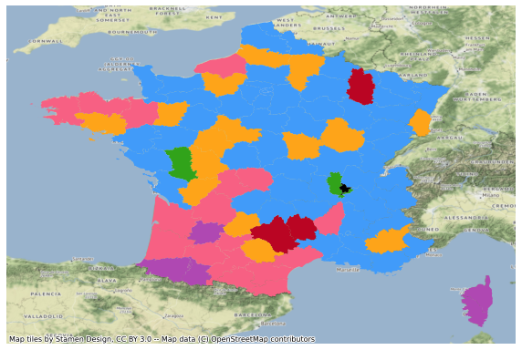

# Parrainages

## Validation de la candidature

Le conseil constitutionnel valide une candidature selon [3 critères distincts](https://presidentielle2022.conseil-constitutionnel.fr/les-parrainages/parrainages-valides-par-candidat.html) présentés ci-dessous.

### Nombre de parrainages

La candidature dispose au moins de 500 parrainages conformes et validés.

Ce graphique présente pour chaque candidat, le nombre total de parrainages valables reçus :

### Représentativité des parrainages

Ces parrainages sont signés par des élus représentant au moins 30 départements ou collectivités d’outre-mer.

Ce graphique présente le nombre de départements d'où sont issus les parrainages par candidat.

### Diversité des parrainages

Moins d'un dixième des parrainages proviennent d'élus d'un même département ou d'une même collectivité d'outre-mer.

## Marrainages

## Quel candidat est soutenu par quel mandat ?

## Quel mandat soutient quel candidat ?

## Evolution du nombre de parrainages par candidat au cours du temps

## Et toi, ton département il est de quelle couleur ?

